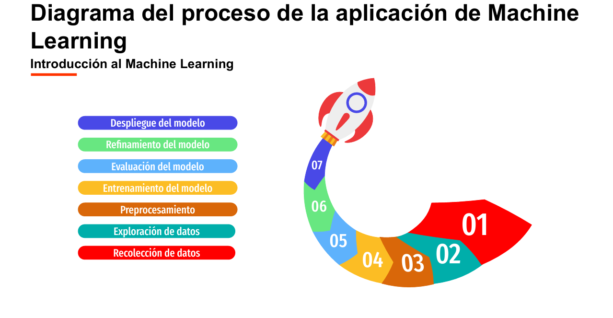

# Tema 1. Introduction
## Documentation
### Yimer Lopez

 Hola mi nombre es Yimer Felipe López 
 

# Resumen
- Modos de enfoque para entrenar la IA
    - Supervidado: Se mapean las entrads a las salu¿idas correcta para hacer predicciones a datos
    - No supervisado: Se dan datos sin etiquetas y se busca encontrar patrones o estructras
    - Por refuerzo: Aprendizaje a partir del ensayo y el error, cada vez que el sistema realiza algo correcto se le compensa.

    ## Video: 3 etapas de la IA
    - Inteligencia artificial estrecha o inteligencia artificial debil: estamso en la actulidad, estas IA se entrenan con información especifica de internet y alcanza la inteligencia humano o la supera en tareas especificas para que las que fueron progamados.
    - Inteligencia artificial General o IA fuerte (AGI): donde la inteligencia artificial tiene las mismas habilidades conigtivas de un humano, donde puede realizar cualquier tarea. Los exportos opinan que ya estamo en la puerta de pasar a ese nivel.
    - Superinteligencia artificial: donde la capacidad intelectual de esta IA supera a los seres humanos mas inteligentes en campos especificos
    
 Estas inteligencias artificiales si se desarrollan de manera descontrolada pueden ser un peligro. Esto según lo expertos.

    ## Video: Que es y como funciona la intelígencia artíficial
    Artilujio artificial que hace tareas propias de la inteligencia humana
    - En este momento estamos en una etapa de aprendizaje a traves de aprendizaje automatica. Donde se entrena un algoritmo con información.
    - Tambien hay aprendizaje semi-supervisado donde pocos datos estan etiquetados. Y se genera un modelo para revisar datos.
        ### Para realizar estos modelos de aprendizaje se utilizan difernetes tecnicas
        - Estadistica y probabilidad clasica
        - Arboles de decisión
        - KNN: K Nearest Neighbours
        - REDES NEURONALES:  cuando hay demasiadas capas de redes neuronales se llaman REDES PROFUNDAS.

    ## ¿Qué es el Aprendizaje Supervisado y No supervisado?
    - Paradigmas de aprendizaje: mecanismo por el cual con información nueva se crea un conocimiento
        - Aprendizaje supervisado
        - Aprendizaje no superfizado
        - Aprendizaje por refuerzo
    
 Uno de los aprendizajes más prometedores es el lenguaje no superivisado donde crea espacio latente donde puede reconcer cosas similares a otras.

## INTRODUCCIÓN AL MACHINE LEANING PARA LA COMPUTACIÓN CIENTÍFICA

### La analitica de datos
- Donde con información que se optiene se analiza y se sacan nueva información que resuelve dudas.
- La analitica de los datos donde por diferente procesos un maquina puede reconocer patrones son: 
    - PROBABILIDAD
    - ALGORITMOS DE AGRUPACIÓN
    - ALGORITMOS BAYESIANOS
    - REDES NEURONALES
    - ÁRBOLES DE DECISIÓN

 Con estos podemos llegar a un aprendizaje y razonamiento con el objetivo de simular la inteligencia humana.

### Inteligencia artificial
Ea la contruccion de programas y maquinas inteligente sque trabajan con programas de computo que puede reañizas tareas realizas por los humanos donde se requiere una proceso cognitivo.

### Recursos principales para ML
- Datos disponibles
- Poder de Cómputo
- Técnicas estadísticas

Para el ML se ingresan observaciones a un modelo y nos va a dar predicciones. Donde se les puede dar un modelo de plantilla --> Con el obejtivo de calibrar un modelo con ejempplos y se le dan datos mal definos para que pueda validar la información.

Al final se busca observar:
- Rendimiento en entrenamiento (calibración)
- Rendimiento en validación (Generalización)

CON EL OBJETIVO DE. Crear pruebas que respalden las desiciones sobre los datos.

## CONJUNTO DE DATOS DE ENTREMIENTO Y PRUEBA

